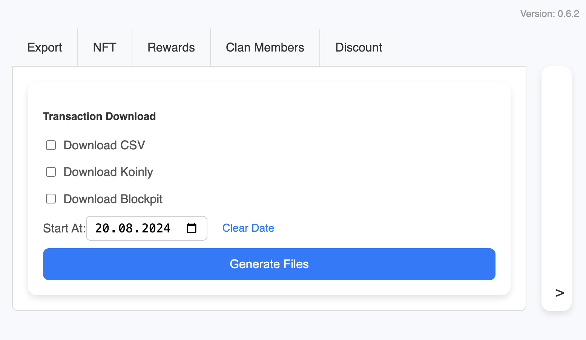

# Chrome Extension: Transaction Downloader

This Chrome extension allows you to inspect cookies, extract the `access_token` automatically, and download transaction data from GoMining in various formats.

[](https://github.com/Ah3n0/gm-transaction-overview)



---

## Installation

### Step 1: Download the Repository
1. Visit the [GitHub repository page](#).
2. Click the green **Code** button and select **Download ZIP**.
3. Extract the ZIP file to a folder on your computer.

### Step 2: Install the Extension in Chrome
1. Open Google Chrome and go to `chrome://extensions`.
2. Enable **Developer Mode** by toggling the switch in the top-right corner.
3. Click **Load unpacked**.
4. Navigate to the folder where you extracted the repository and click **Select Folder**.
5. The extension will now appear in your list of installed extensions.

### Step 3: Using the Extension
1. **Pin the Extension** (optional but recommended):
   - Click the puzzle piece icon in Chrome's toolbar (top-right corner).
   - Find the newly installed extension in the list and click the pin icon to keep it visible.
2. **Open the Extension** by clicking its icon in the toolbar.
3. **Follow the On-Screen Instructions**:
   - Ensure you are logged into GoMining (no credentials are required by the extension).
   - Select the files you wish to download using the provided checkboxes.
4. **Enjoy the Features** offered by the extension!

---

## Features

1. **Login Status Check**: Confirms if the user is logged into GoMining.
2. **File Format Selection**: Supports CSV, Koinly, and Blockpit formats for downloads.
3. **Transaction Data Download**: Automatically generates and downloads transaction data.
4. **User-Friendly Interface**: Simple and intuitive design with clear instructions.
5. **Custom Date Range**: Add functionality to select a specific start date for reports.

---

## Contributing

We welcome contributions to improve this project. To get started:
1. Fork the repository on GitHub.
2. Create a new branch for your feature or bug fix.
3. Make your changes and commit them with descriptive messages.
4. Push your branch to your fork.
5. Submit a Pull Request (PR) to merge your changes into the original repository.

---

## Roadmap

Here are some planned features and improvements for future updates:
1. **Background Processing**: Allow downloads to continue processing even when the popup is closed.
2. **Wallet Integration**: Add BTC wallet support and enable wallet selection.
3. **Buy/Sell Data**: Include transactions unrelated to GMT/BTC wallets in the generated files.

---

## Support the Project

If you enjoy using this extension and would like to support its development, consider the following options:

1. **Refer Friends to GoMining**: Use this [GM referral link](https://gomining.com/?ref=Zi-68) - Code Zi-68.
2. **Donate BTC on BNB Chain**:
   Send BTC (on BNB Chain) to the following address:
   ```bash
   0x4FdE75419b39E8108C4A19C23A55182c80d418D1
   ```

Your support is greatly appreciated!

---

## License

This project is licensed under the [MIT License](LICENSE). Feel free to use, modify, and share it, but please credit the original authors.

---

**Thank you for using this project!** If you have any questions or suggestions, feel free to open an issue on GitHub.
